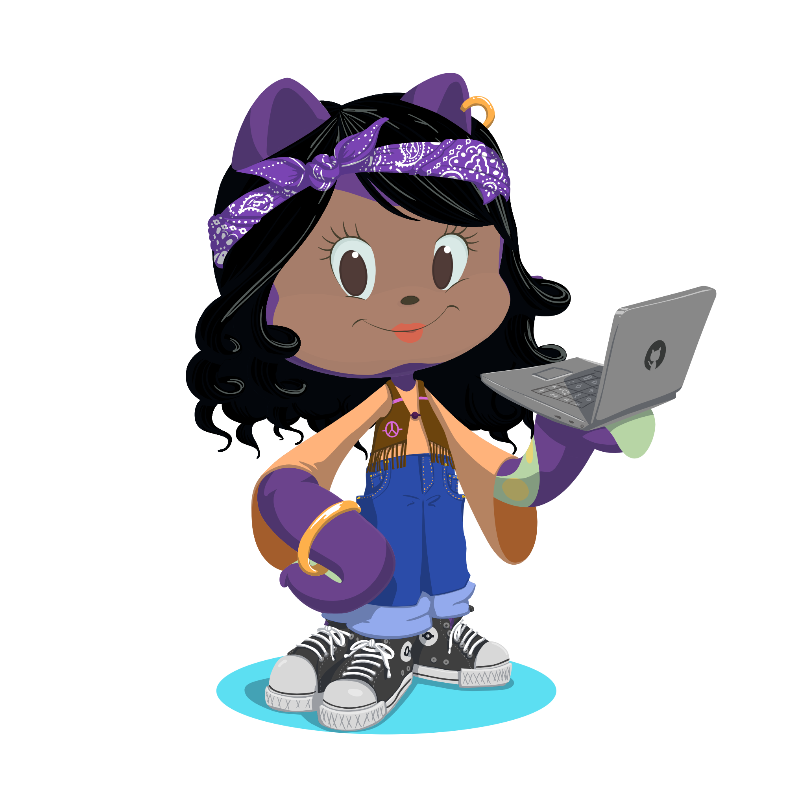

## Hello, world! 👋

Welcome to my GitHub space. I'm Dorianys, an enthusiastic student at Laboratoria's coding bootcamp, learning to program with passion and determination! 💻

✨ My superpowers include:

- **JavaScript**: My primary weapon for creating interactivity and bringing web pages to life.
- **HTML**: The language with which I build the solid foundations of my projects.
- **CSS**: I take care of adding style and personality to my creations.
- **Node.js**: I'm expanding my horizons into server-side development!
- **Trello**: My faithful ally for organizing and managing projects efficiently.
- **Figma**: A magical canvas where I design and create prototypes with love.

⚡ When I'm not immersed in lines of code, I love exploring new technologies, solving programming challenges, and creating unique experiences. I also enjoy sharing knowledge and learning from other passionate developers.

I'm excited to be part of this incredible community of developers! If you have an exciting project, a great idea, or just want to chat about technology, feel free to reach out. Together, we can do amazing things!

Follow me on this journey and discover how code can change the world! 🚀✨

Happy coding! 😄

###
---

###
---

<h3 align="center">✨ Tools & Languages ✨</h3>

 

  

  

  

  

  

  

  
 

  

